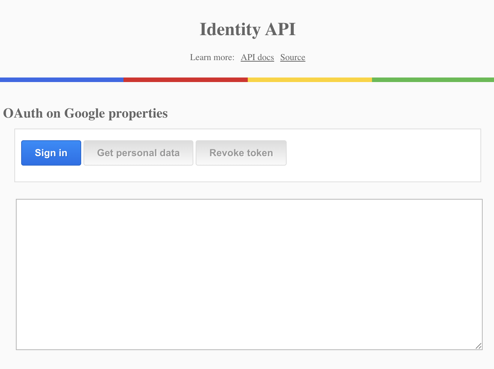

# chrome.identity

A sample extension that uses the
[Identity API](https://developer.chrome.com/docs/extensions/reference/api/identity)
to request information of the logged in user and present this info on the
screen. If the user has a profile picture, their profile image is also fetched
and shown in the app.

## Overview

This extension uses the getAuthToken flow of the Identity API, so it only
works with Google accounts. If you want to identify the user in a non-Google
OAuth2 flow, you should use the launchWebAuthFlow method instead.

## Running this extension

1. Clone this repository.
2. Load this directory in Chrome as an [unpacked extension](https://developer.chrome.com/docs/extensions/mv3/getstarted/development-basics/#load-unpacked).
3. Click the extension icon to open the UI.
