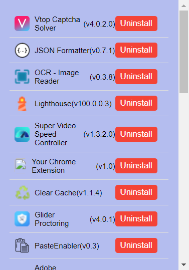

# chrome.management Extension

The [`chrome.management`](https://developer.chrome.com/docs/extensions/reference/api/management) API provides ways to manage the list of extensions that are installed and running. It is particularly useful for extensions that [override](https://developer.chrome.com/extensions/develop/ui/override-chrome-pages) the built-in New Tab page.

## Features

- Lists all installed extensions.
- Displays extension icons, names, and versions.
- Provides an **Uninstall** button for each extension.
  
  

## Installation

1. Clone or download this repository.
2. Load the extension in Chrome as an [unpacked extension](https://developer.chrome.com/docs/extensions/mv3/getstarted/development-basics/#load-unpacked).

## Usage

1. Click the extension icon to open the extension manager. The manager will list all installed extensions. Each extension entry includes its icon, name, and version.
2. Click the **Uninstall** button next to an extension to remove it.

## Code Overview

### `popup.js`

- Uses `chrome.management.getAll()` to get a list of all installed extensions.
- Creates a list item for each extension, including its icon, name, version, and an **Uninstall** button.
- Sends a message to the extension service worker (`background.js`) to uninstall an extension when the **Uninstall** button is clicked.

### `background.js`

- Listens for messages from the popup.
- Handles uninstallation requests by calling `chrome.management.uninstall()` with the extension ID.
- Sends a response back to the popup after uninstalling the extension.

## License

This project is licensed under the MIT License - see the [LICENSE](LICENSE) file for details.
