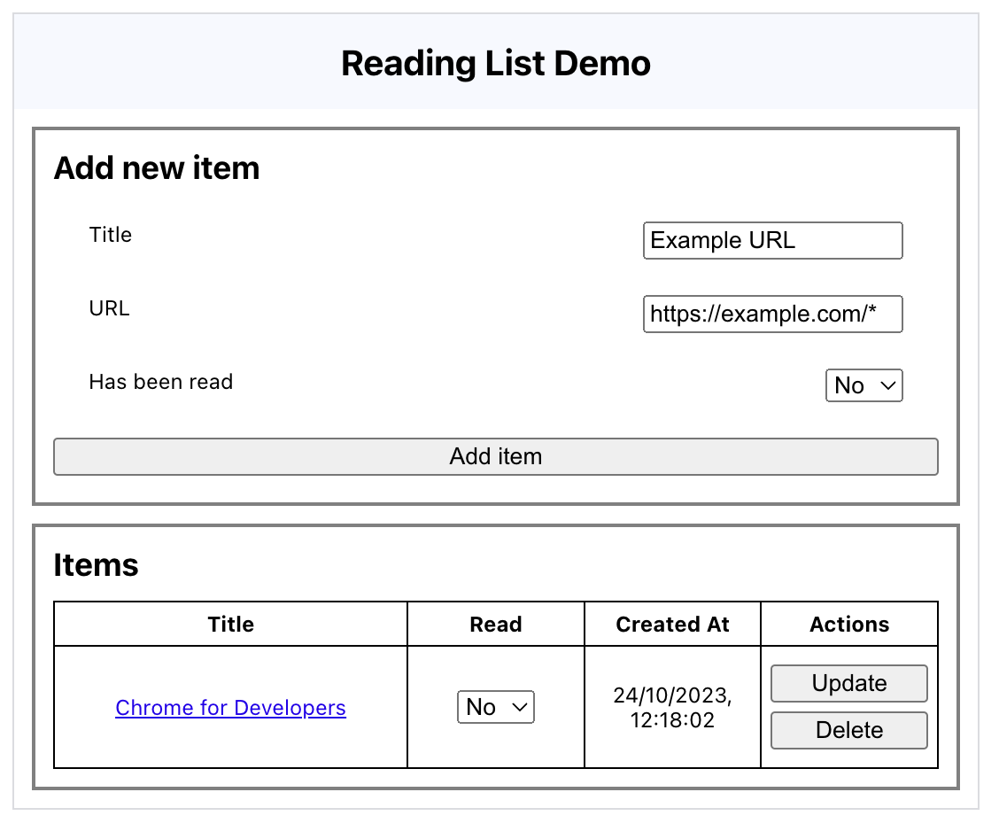

# chrome.readingList API

This sample demonstrates using the [chrome.readingList](https://developer.chrome.com/docs/extensions/reference/readingList/) API to view items in the reading list.

## Overview

The extension's action icon opens a page that allows you to add new items, as well as update or delete existing ones.

## Running this extension

1. Clone this repository.
2. Load this directory in Chrome as an [unpacked extension](https://developer.chrome.com/docs/extensions/mv3/getstarted/development-basics/#load-unpacked).
3. Click on the action icon.
4. An extension page will open.

## Implementation Notes

Listeners are added for all events, so the table automatically updates when data in the reading list changes.
