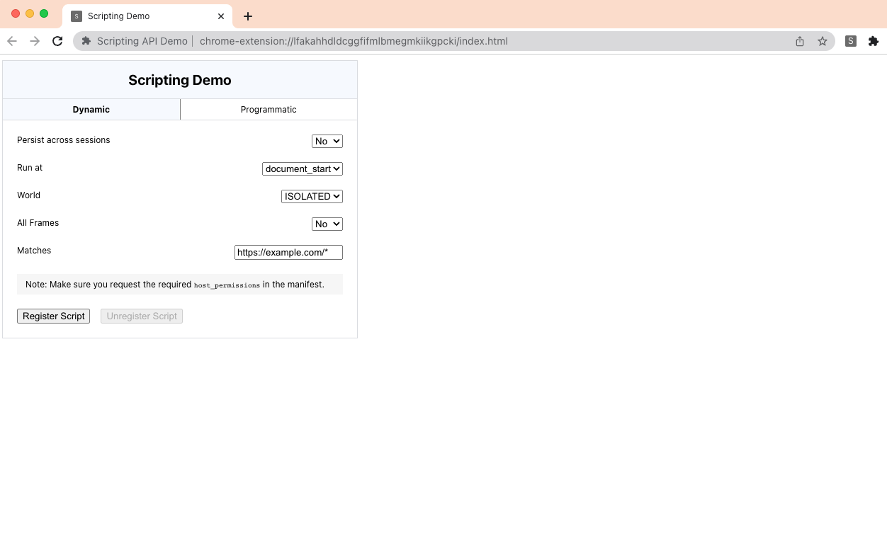

# chrome.scripting API

This sample demonstrates using the [chrome.scripting](https://developer.chrome.com/docs/extensions/reference/scripting/) API to inject JavaScript into web pages.

## Overview

Once this extension is installed, clicking this extension's action icon will open an extension page.

## Features

This sample allows you to experiment with the following injection mechanisms:

- [Dynamic Declarations](https://developer.chrome.com/docs/extensions/mv3/content_scripts/#dynamic-declarative), where a content script is registered at runtime.
- [Programmatic Injection](https://developer.chrome.com/docs/extensions/mv3/content_scripts/#programmatic), where a script is programatically executed in a tab which is already open.

Learn more at https://developer.chrome.com/docs/extensions/mv3/content_scripts/.

## Implementation Notes

Programmatic injection is handled in the service worker. A tab is opened to a specific URL (https://example.com/#inject-programmatic). When the page finishes loading, a script is then run using `chrome.scripting.executeScript`.

When registering a dynamic content script, a tab is automatically opened if using the default matches URL. Otherwise, no tab is opened and the correct URL needs to be manually navigated to.
