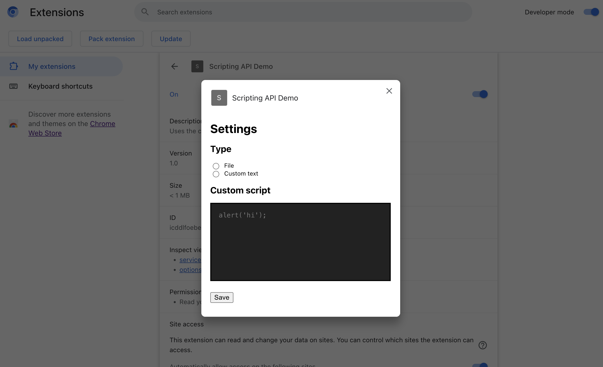

# chrome.userScripts API

This sample demonstrates using the [`chrome.userScripts`](https://developer.chrome.com/docs/extensions/reference/scripting/) API to inject JavaScript into web pages.

## Overview

Clicking this extension's action icon opens an options page.

## Running this extension

1. Clone this repository.
2. Load this directory in Chrome as an [unpacked extension](https://developer.chrome.com/docs/extensions/mv3/getstarted/development-basics/#load-unpacked).
3. Click the extension's action icon to open the options page.
4. Once a user script has been configured, visit https://example.com/.

## Features

This sample allows you to inject the following:

- Files
- Arbitrary code

## Implementation Notes

The User Scripts API requires users to enabled developer mode. We check for this by attempting to access `chrome.userScripts`, which throws an error on property access if it is disabled.

When a change is made on the options page, use the `chrome.userScripts` API to update the user script registration.
