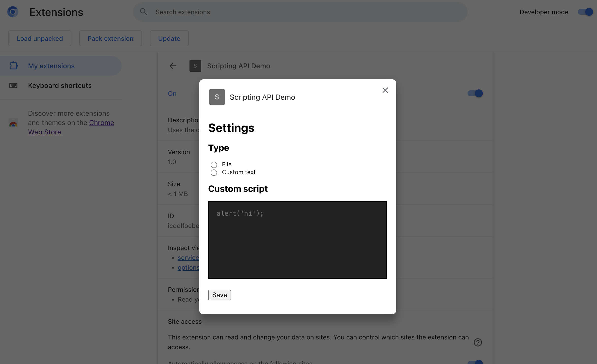

# chrome.userScripts API

This sample demonstrates using the [`chrome.userScripts`](https://developer.chrome.com/docs/extensions/reference/api/userScripts/) API to inject JavaScript into web pages.

## Overview

Clicking this extension's action icon opens an options page.

## Running this extension

1. Clone this repository.
2. Load this directory in Chrome as an [unpacked extension](https://developer.chrome.com/docs/extensions/mv3/getstarted/development-basics/#load-unpacked).
3. Click the extension's action icon to open the options page.
4. Once a user script has been configured, visit https://example.com/.
5. Use the **Execute** button to run one-off code in an open https://example.com/ tab.

## Features

This sample allows you to inject the following:

- Files
- Registered arbitrary code
- One-off arbitrary code with `chrome.userScripts.execute()`

## Implementation Notes

The User Scripts API requires users to enable developer mode or the Allow User Scripts extension toggle. We check for this before registering or executing scripts.

When a change is made on the options page, use the `chrome.userScripts` API to update the user script registration. The **Execute** button uses `chrome.userScripts.execute()` to inject code into an existing https://example.com/ tab without registering it.
