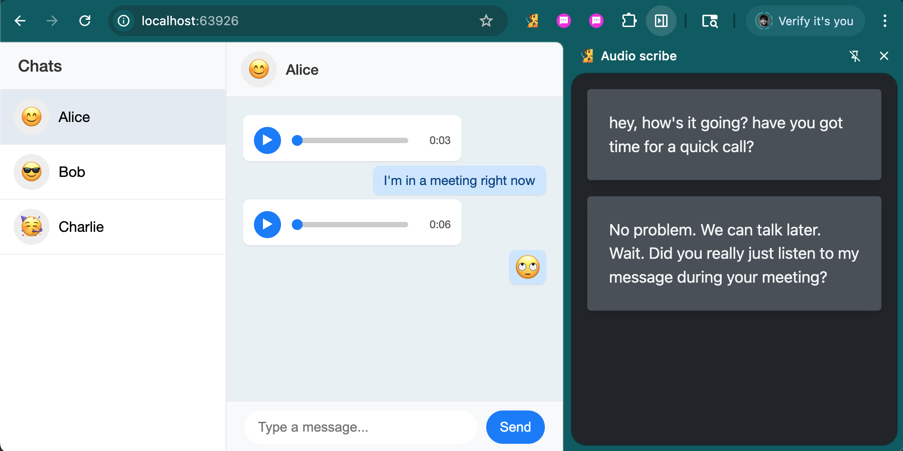

# Audio-Scribe: On-device multimodal AI with Gemini Nano - audio transcription

This sample demonstrates how to use the audio transcription capabilities of the multi-modal Gemini Nano API preview. To learn more about the API and how to sign-up for the origin trial, head over to [Built-in AI on developer.chrome.com](https://developer.chrome.com/docs/extensions/ai/prompt-api).

## Overview

This extension adds a sidepanel that will, when opened, display a transcription of all audio files on a web page (currently it looks only for audio files created using `URL.createObjectUrl`).

## Running this extension

1. Clone this repository.
1. Load this directory in Chrome as an [unpacked extension](https://developer.chrome.com/docs/extensions/get-started/tutorial/hello-world#load-unpacked).
1. Open the audio-scribe sidepanel by clicking the audio-scribe action or by pressing the `ALT + A` keyboard shortcut.
1. Open a chat app in the browser, for example https://web.whatsapp.com/. You can also run the demo chat app via:
   ```
   npx serve demo-chat-app
   ```
1. All audio messages in the current chat will be transcribed in the side panel.


