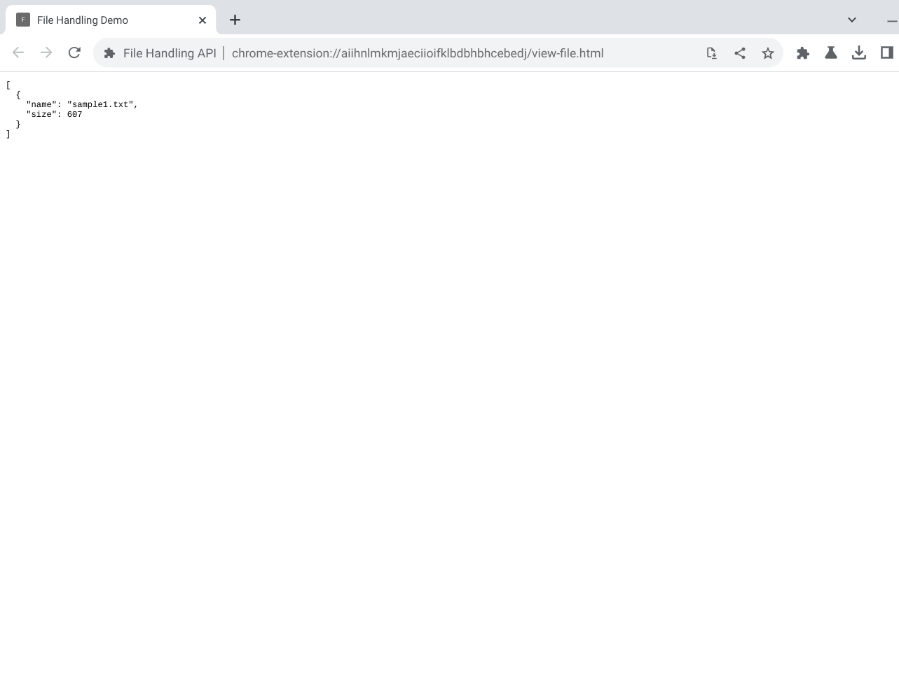

# Cookbook - File Handling

This sample demonstrates file handling in an extension.

## Overview

On ChromeOS only, extensions can use the `file_handlers` manifest key to
register as a file handler for particular file types. This behaves in a similar way to the
[equivalent key](https://developer.mozilla.org/docs/Web/Manifest/file_handlers) in web
applications. As with web applications, you use the [Launch Handler API](https://developer.mozilla.org/en-US/docs/Web/API/Launch_Handler_API) to open and process a file.

This extension lets you open text files and see their name and size on the opened extension page. This could be a good starting point for building an extension that displays or interacts with an opened file.

## Running this extension

**This API is only supported on ChromeOS**.

1. Clone this repository.
2. Load this directory in Chrome as an [unpacked extension](https://developer.chrome.com/docs/extensions/mv3/getstarted/development-basics/#load-unpacked).
3. Create a text file on your ChromeOS device.
4. In the Files app, select the file.
5. In the toolbar, choose "Open" and then "File Handling Demo".
