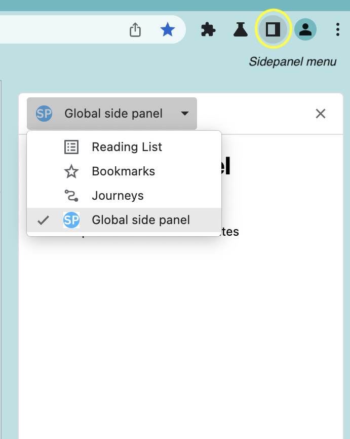
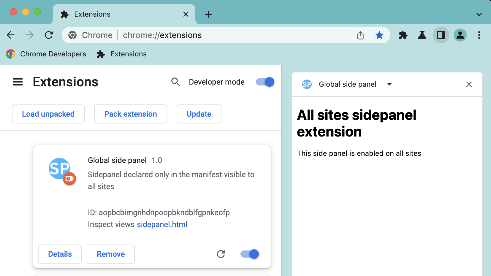

# Global Side panel example

This example demonstrates how to display the same side panel on every site using the [Side Panel API](https://developer.chrome.com/docs/extensions/reference/sidePanel/).

## Running this extension

1. Clone this repository.
2. Load this directory in Chrome as an [unpacked extension](https://developer.chrome.com/docs/extensions/mv3/getstarted/development-basics/#load-unpacked).
3. Open the side panel UI

   

4. Choose the "Global side panel".

   
