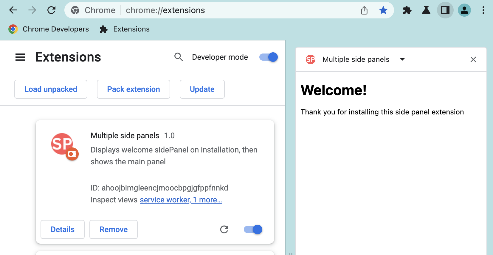
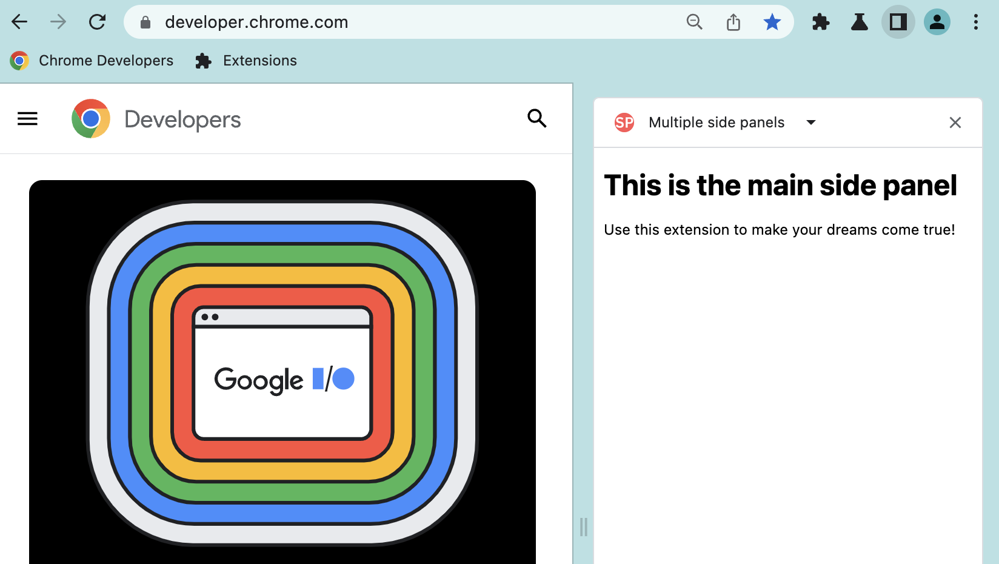

# Multiple side panels example

You can use [`sidepanel.getOptions()`](https://developer.chrome.com/docs/extensions/reference/sidePanel/#method-getOptions) to retrieve the current side panel and switch between side panels. This example sets a welcome side panel when the extension is first installed, then when the user navigates to a different tab, it replaces it with the main side panel.

## Running this extension

1. Clone this repository.
2. Load this directory in Chrome as an [unpacked extension](https://developer.chrome.com/docs/extensions/mv3/getstarted/development-basics/#load-unpacked).
3. Open the side panel UI
4. Choose "Multiple side panels" to see the welcome page.

5. Navigate to https://developer.chrome.com to see the main side panel.

