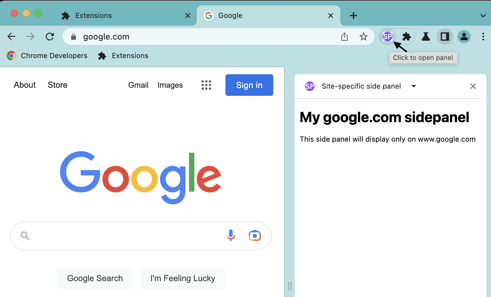

# Site-specific side panel example

This example demonstrates how to display the side panel only on google.com using the [Side Panel API](https://developer.chrome.com/docs/extensions/reference/sidePanel/). It also allows users to open the side panel by clicking on the [action icon](https://developer.chrome.com/docs/extensions/reference/action/) or a keyboard shortcut.

## Running this extension

1. Clone this repository.
2. Load this directory in Chrome as an [unpacked extension](https://developer.chrome.com/docs/extensions/mv3/getstarted/development-basics/#load-unpacked).
3. [Pin](https://developer.chrome.com/docs/extensions/mv3/getstarted/development-basics/#pin) the extension.
4. Go to https://www.google.com.
5. Click on the action icon to open the side panel.

💡 You can also open the side panel by pressing `Ctrl+B` (Windows) or `Cmd+B` (macOS).

