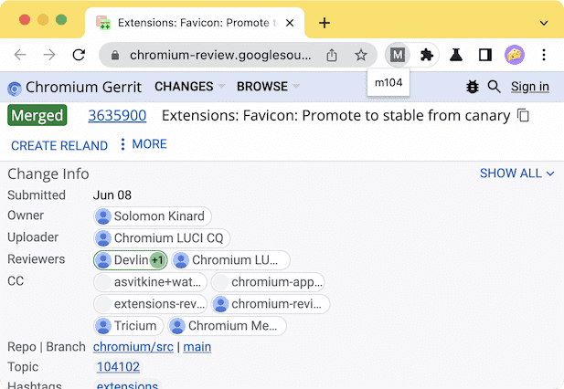

Clicking this extension's action button while viewing a Chromium code review will open a small popup that shows what (if any) Chromium version the review was merged into. If the CR has not yet been merged or if the extension cannot find the version it was merged into, the action popup will automatically close itself.

# Demo

1. Install this extension
2. Visit https://chromium-review.googlesource.com/c/chromium/src/+/3635900
3. Click the extension's action icon

Once the extension retrieves the merged milestone information, it will appear in the extnesion's popup as shown below

