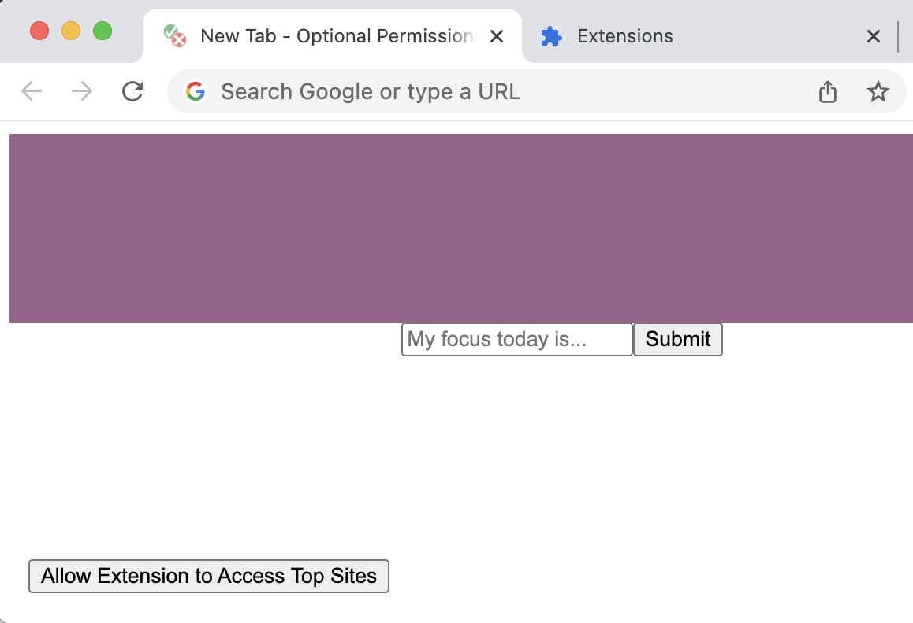
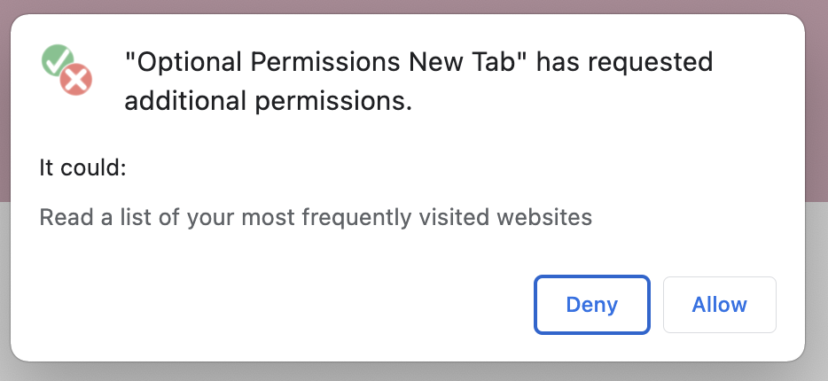
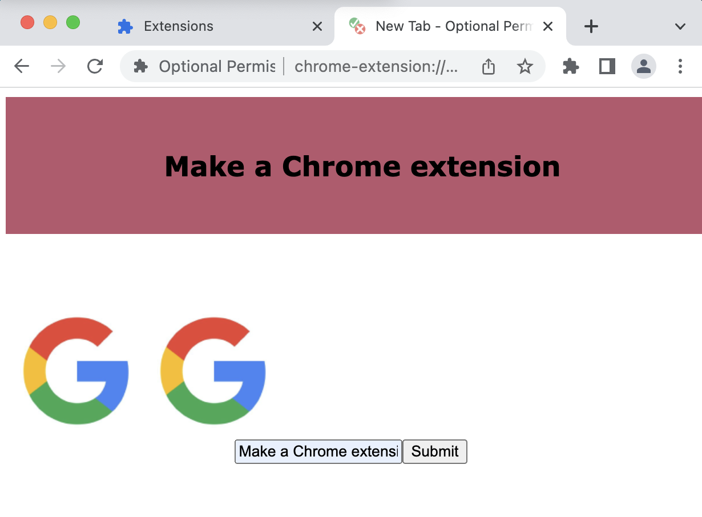

## Optional permissions in a new tab

This new tab extension demonstrates how extensions can provide users the option to enable an additional feature. In this example, they optionally display top sites.

See [Optional permissions](https://developer.chrome.com/docs/extensions/reference/permissions/) to learn more.

## Testing the extension

Follow the instructions to load an [unpacked extension](https://developer.chrome.com/docs/extensions/mv3/getstarted/development-basics/#load-unpacked, then open a new tab.

It should look like this:

Then, click on "Allow Extension to Access to top sites". You will see the following message:

If you accept, it will display a list of your top sites.

