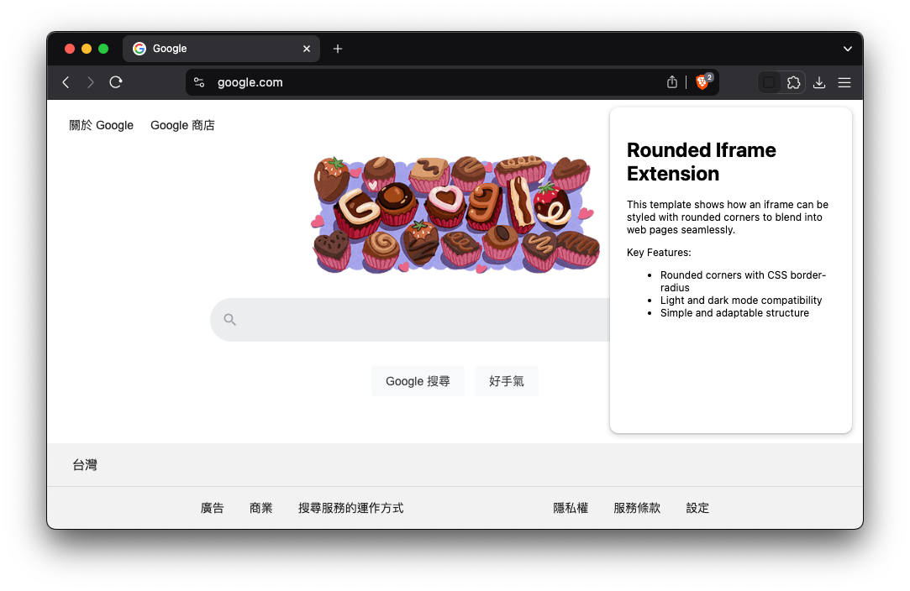
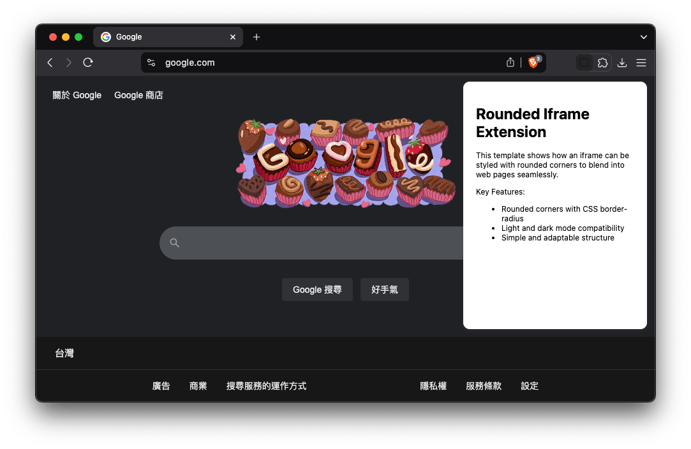

# Rounded Iframe Chrome Extension – A UI Enhancement Template

This repository provides a Chrome extension template that demonstrates how to use an `iframe` to create a rounded-corner interface. The key design is achieved through the structural use of `iframe` along with CSS settings that ensure consistent appearance across both light and dark modes.

## 1. Overview
This extension displays a simple interface within an `iframe` with rounded corners. By leveraging the `color-scheme: light` CSS property, the extension maintains a clean and consistent look even when the website uses dark mode.

> The inspiration for this template stems from discussions across various platforms, including [Stack Overflow](https://stackoverflow.com/questions/27899635/how-to-make-border-radius-in-popup-chrome-extension) and the [Chrome Extensions Samples repository](https://github.com/GoogleChrome/chrome-extensions-samples/issues/657), where developers have explored methods to implement rounded corners in extensions. Notably, the Google Keep Chrome Extension has been recognized for its effective use of rounded corners. Inspired by its advanced techniques, this template simplifies and adapts those methods to assist developers in creating more visually appealing extension interfaces.

## 1.1 Screenshots

Below are the screenshots demonstrating the rounded-corner effect in both light and dark modes:

### Light Mode


### Dark Mode


The interface is displayed within an `iframe` with rounded corners, ensuring consistency across light and dark modes.

## 2. Architecture
The extension consists of the following files:

- **manifest.json**: Defines the extension's metadata and permissions.
- **service-worker.js**: Manages the creation, injection, and behavior of the `iframe`.
- **iframe.html**: The core HTML structure rendered inside the `iframe`.
- **iframe-styles.css**: Styles the interface with rounded corners and shadows.
- **README.md**: Documentation for developers.

### Core Design Concept
The rounded corners are achieved by:
1. Creating an `iframe` and injecting it into the target page.
2. Applying `border-radius` to the content within the `iframe`.
3. Using `color-scheme: light` to prevent automatic dark mode transformations.

```css
.content-wrapper {
  border-radius: 10px;
  box-shadow: 0 1px 2px rgba(60, 64, 67, 0.3),
              0 2px 6px rgba(60, 64, 67, 0.15);
  background: #fff;
}
```

## 3. How It Works
- Clicking the extension icon toggles the `iframe`.
- The `iframe` is positioned in the top-right corner of the webpage.
- Clicking outside the `iframe` or pressing `Escape` closes it.
- Dark mode is handled using `color-scheme: light`.

### Key Snippet from `service-worker.js`
```js
iframe.style.cssText = `
  /* Positioning */
  position: fixed;
  top: 5px;
  right: 5px;
  z-index: 2147483647;

  /* Sizing */
  height: 400px;
  width: 300px;

  /* Appearance */
  border: none;
  background: transparent;

  /* Color Scheme */
  color-scheme: light;
`;
```

## 4. Installation
1. Open Chrome and navigate to `chrome://extensions`.
2. Enable Developer Mode.
3. Click **Load Unpacked** and select the project folder.

## 5. Customization
- Adjust the `height` and `width` of the `iframe` in `service-worker.js`.
- Modify `iframe-styles.css` for visual customization.

## 6. Security Considerations
- Ensure the `iframe` only loads trusted content.
- Use a strict `Content-Security-Policy` to prevent potential vulnerabilities.

## 7. Known Limitations
- The extension currently displays a static interface. Additional UI elements or interactions can be implemented.
- May behave inconsistently if the host website employs aggressive CSS resets.

This template serves as a foundation for creating extensions with rounded interfaces using `iframe` elements and CSS strategies that maintain visual consistency across themes.

