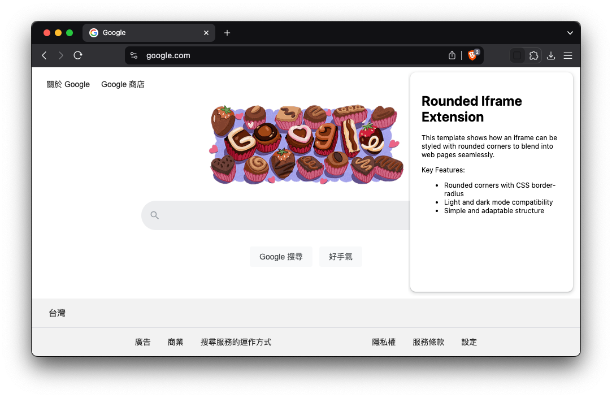
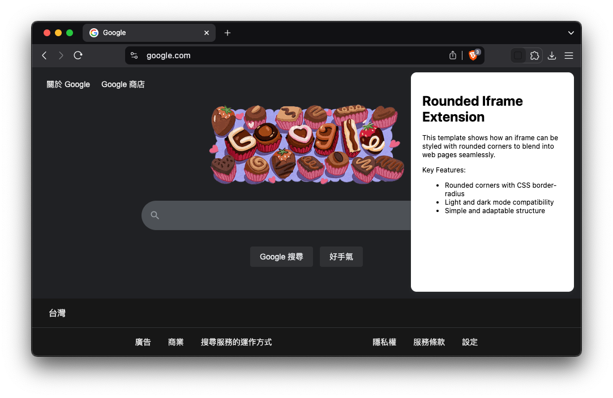

# Rounded iframe UI template

This sample demonstrates how to render an extension UI inside a rounded `iframe` that stays visually consistent across light and dark themes. It uses the [chrome.action](https://developer.chrome.com/docs/extensions/reference/api/action) API to toggle the UI and the [chrome.scripting](https://developer.chrome.com/docs/extensions/reference/scripting/) API to inject the iframe into web pages.

## Overview

When the user clicks the extension icon, the extension injects a fixed-position `iframe` in the top-right corner of the current page. The UI inside the iframe has rounded corners and a card-like shadow, and uses the `color-scheme: light` CSS property to avoid automatic dark-mode transformations on dark sites.

Inspired by discussions on rounded corners in extension UIs (for example, [issue #657](https://github.com/GoogleChrome/chrome-extensions-samples/issues/657)), this sample provides a minimal, reusable template for building similar UIs.

## Screenshots

Light and dark mode examples:





## Running this extension

1. Clone this repository.
2. Load this directory in Chrome as an [unpacked extension](https://developer.chrome.com/docs/extensions/mv3/getstarted/development-basics/#load-unpacked).
3. Navigate to any `http` or `https` page and click the extension icon to toggle the iframe.

## Key implementation details

The extension consists of the following files:

- **manifest.json**: Declares permissions (`activeTab`, `scripting`), the action icon, and the background service worker.
- **service-worker.js**: Handles `chrome.action.onClicked`, injects the iframe, and manages its lifecycle.
- **iframe.html**: Markup rendered inside the iframe.
- **styles/iframe-styles.css**: Styles the inner UI with rounded corners and a card-like appearance.

### Layout and rounded corners

Rounded corners and the card effect are applied inside the iframe:

```css
.content-wrapper {
  margin: 4px 8px 8px 4px;
  background: #fff;
  border-radius: 10px;
  box-shadow:
    0 1px 2px 0 rgba(60, 64, 67, 0.3),
    0 2px 6px 2px rgba(60, 64, 67, 0.15);
  padding: 20px;
  box-sizing: border-box;
  height: calc(100% - 12px);
}
```

The iframe itself is positioned in the viewport and forced into a light color scheme:

```js
iframe.style.cssText = `
  /* Positioning */
  position: fixed;
  top: 5px;
  right: 5px;
  z-index: 2147483647;

  /* Sizing */
  height: 400px;
  width: 300px;

  /* Appearance */
  border: none;
  background: transparent;

  /* Color Scheme */
  color-scheme: light;
`;
```

## Behavior and interaction

- Clicking the extension icon toggles the iframe on the current tab.
- Clicking outside the iframe or pressing `Escape` closes it.
- The iframe is only injected into pages whose URL starts with `http` or `https` to avoid restricted schemes like `chrome://` and `file://`.

## Customization

- Adjust the iframe size by changing the `height` and `width` values in `service-worker.js`.
- Tweak the look and feel (radius, shadow, padding, typography) by editing `styles/iframe-styles.css`.
- Replace the contents of `iframe.html` with your own UI while reusing the same injection pattern.

## Known limitations

- The sample currently shows a static UI; additional interactions or data flows can be added as needed.
- On pages with very aggressive CSS resets, visual differences may appear, although the iframe isolation minimizes this in practice.
