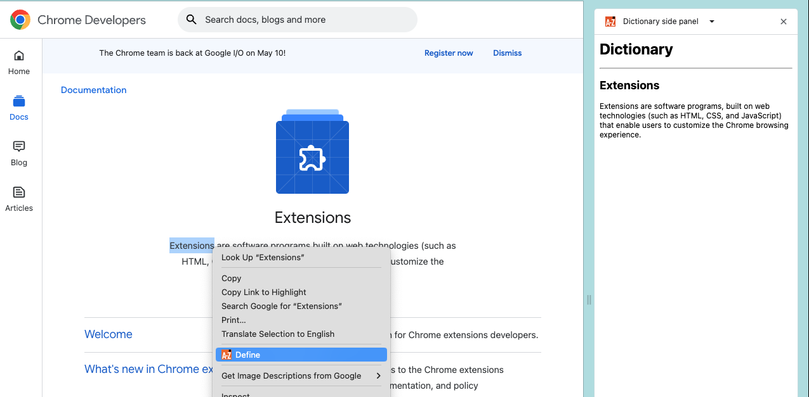

# Dictionary Side panel example

This example allows users to right-click on a word and see the definition on the side panel using the [Side Panel API](https://developer.chrome.com/docs/extensions/reference/sidePanel/).

NOTE: This example only defines the word extensions and popup.

## Implementation Notes

When the user selects a word, we need to send it to the side panel, but that
may not be open yet. To handle this we store the word in
`chrome.storage.session`, which results in the following:

- If the side panel is already open, the `storage.session.onChanged` event
  will fire in the side panel.
- Otherwise, the value will be loaded from storage when the side panel opens.

## Running this extension

1. Clone this repository.
2. Load this directory in Chrome as an [unpacked extension](https://developer.chrome.com/docs/extensions/mv3/getstarted/development-basics/#load-unpacked).
3. Go to https://developer.chrome.com/docs/extensions/
4. Right-click on the "Extensions" word.
5. Choose the "Define" context menu

You should see the definition on the side panel

