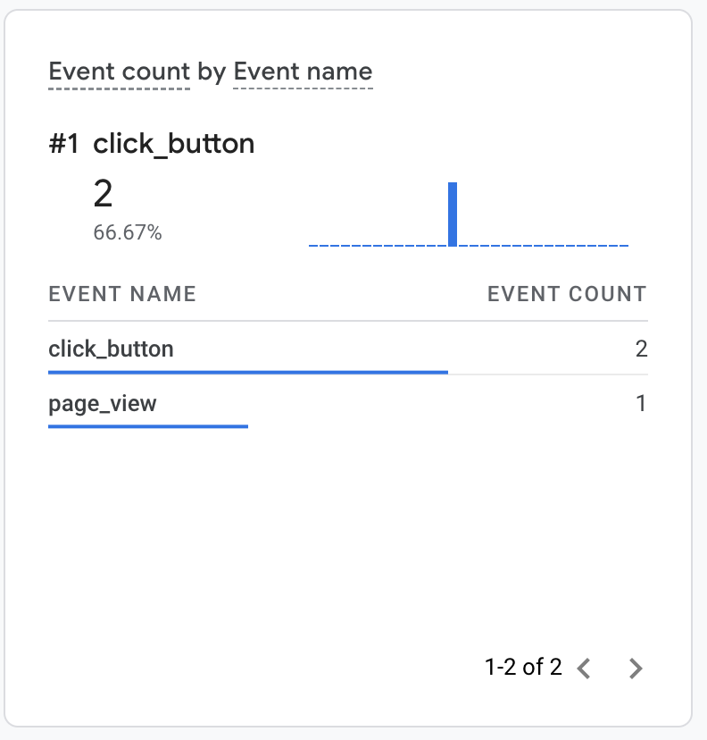

# Google Analytics 4 example

This example demonstrates how to track extension events in Google Analytics 4 using the Measurement Protocol.

## Running this extension

1. Clone this repository.
2. Get your `api_secret` and the `measurement_id` as described in the [Measurement Protocol documentation](https://developers.google.com/analytics/devguides/collection/protocol/ga4). Add these in [scripts/google-analytics.js](scripts/google-analytics.js):
   ```
   const MEASUREMENT_ID = '<measurement_id>';
   const API_SECRET = '<api_secret>';
   ```
3. Load this directory in Chrome as an [unpacked extension](https://developer.chrome.com/docs/extensions/mv3/getstarted/development-basics/#load-unpacked).
4. Click the extension icon to open the extension popup and click the button to generate a few analytics events.
   
5. Check out the [real-time report](https://support.google.com/analytics/answer/1638635) to see how the events surface in Google Analytics.


