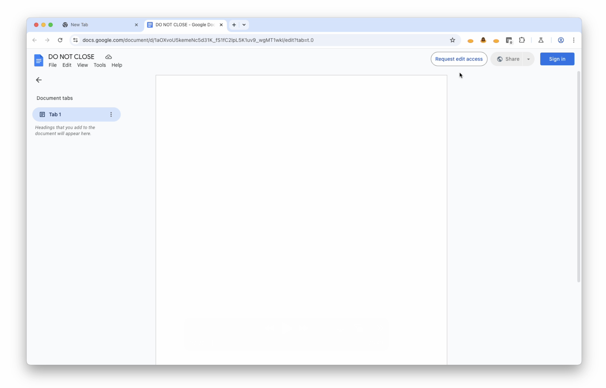

# Mole Game

This mole game is based on a YouTube tutorial in our Chrome Extensions series. Watch it [here](https://goo.gle/Chrome-Ext).

## Overview

In the sample, moles periodically appear from pipes in the browser toolbar. You score points by clicking the icon before the mole disappears.

If enabled, a browser tab is closed if you miss one of the moles.

## Implementation Notes

Each icon in the browser toolbar is a seperate extension. The extensions communicate using the `chrome.runtime.sendMessage` API and the `chrome.runtime.onMessageExternal` event.

To discover mole extensions, the controller extension uses the `chrome.management` API.

By default, the tab closing behavior is disabled. You can enable this by commenting out the line in `mole/service-worker.js`.

## Running this extension

1. Clone this repository.
1. Make several copies of the `mole` directory.
1. Load the `controller` directory and all mole directories in Chrome as [unpacked extensions](https://developer.chrome.com/docs/extensions/mv3/getstarted/development-basics/#load-unpacked).
1. Wait for a mole to appear!
